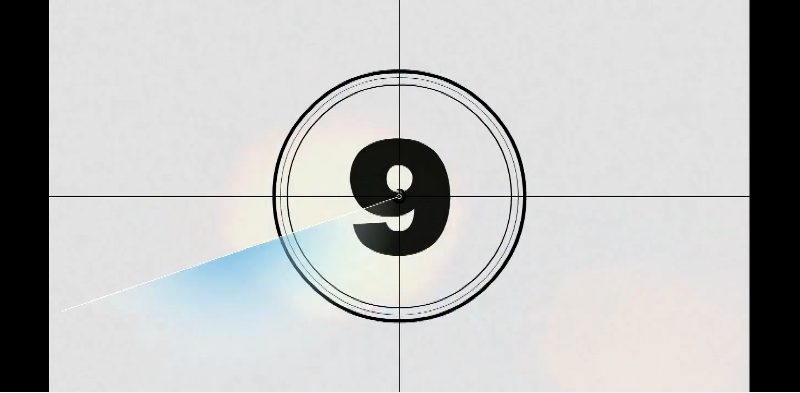

# Video-Augmentation-Code
In this repository, a simple implementation of Video augmentation is provided to augment videos for machine learning training tasks. 

### Introduction:
In machine learning, a lot of times we have to deal with insufficient data. To remedy this, we augment our data so that our model can generalize well to all kinds of input data and be able to take the right decisions.

For image based tasks, we can use any number of augmentation methods. Keras provides ImageDataGenerator function, then Pytorch has some functions and there is one library called imgaug that allows augmentation with different specifications too. In this repository, I used imgaug to augment images.

To augment video, the process is mostly same because a video is actually a collection of pictures (frames) ran fast at a speed called Frames Per Seconds (FPS), thus making it a video.

### Process:
Simply put, we will fetch each frame of input videos and augment them just as we augment an image and store all such images in a temporary folder. We then pack those images in temporary folder to create a video.

### Pre-requisites:
The libraries that come in handy for video augmentation are as follows: 
1. Opencv - To get video FPS (Can be installed using pip install opencv-python)
2. imgaug - for Image augmentation (Can be installed using pip install imgaug)
3. imageio - for video reading and image and writing (Can be installed using pip install imageio)
4. imageio-ffmpeg - for creating video from images (Can be installed using pip install imageio-ffmpeg)

Rest are basic libraries os, shutil (for creating/removing folders), random (for generating random numbers) and argparse (to fetch command line arguments).

### Command to run the code
For running the code, one should use command line and write the following command where: 
  'main-folder' is the folder where clips to be augmented reside,
  'output-folder' is the folder where the augmented clips are stored,
  'max-clips' is the number of clips we want augmented per input clip
  
So if max_clips is 3 then per input, 3 augmented versions of each input clip will be created. Following command can be used where code is stored, to run video augmentation:

python video_augmentation_code.py --main-folder [Input folder path] --output-folder [Path to save videos at] --max-clips <Per input, # of maximum augmented videos>

### Result:
For augmentation of videos, I have used a random number generator to generate video rotation angle, and same for noise to be added to video. Here is the result of the code, (unfortunately) a snap of each clip as video cannot be posted here. It is just to show how the augmentation works. Feel free to try on your own clips to see augmented videos.
#### Input clip snapshot:

#### Output clip snapshot:

### Conclusion:
Hopefully this code can be used to make it easier for machine learning enthusiasts to augment their videos to come up with robust models to solve real-world problems. Feel free to tweak the code to your liking. And if the code helps, give a star :)
